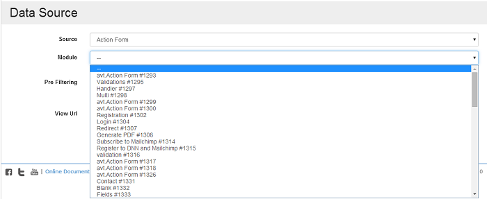

# Action Form

One of the main use cases of the Action Grid module is to manage data submitted via Action Form. This includes querying, editing and deleting data. The integration is seamless. Simply add an Action Grid module to a page and select one of the Action Form modules to connect to. If you are interested how this works, read more below. 

This integration was straightforward because Action Form saves all data in an internal reports table. In the past, this used to be an action that was added just like the rest of the actions. But then other functionalities were built on top of it such as the auto save or multistage submits (for example the PayPal action). In recent versions of Action Form you have the option to choose which fields are saved in the reports table. Be aware that only the included fields will appear in the Action Grid module. 

But the internal reports table is not optimized for querying such as free text search, sorting or filtering. Because of this, Action Grid implements a Lucene index where data is cached and optimized accordingly. This index is kept in sync with the Action Form internal reports table using an incremental algorithm. Note that this is an abstract class from which you can derive to implement additional data sources. Read the section on Implementing [Custom Data Sources](custom-data-sources.md) for more information. 

Once an Action Form module is selected as data source, the admin screen will load all fields from that form. The fields can’t be removed, but they can be turned off – and later back on if needed. While off, the fields won’t appear in the grid, but they can still be used in the actions which run on events on the server side. The Action Form data source will try to best determine each field’s capabilities. For example, it will automatically make dropdowns filterable. Each field can be expanded to configure its capabilities in terms of sorting, searching and filtering, thus overriding the defaults. 

The field names are initialized with their respective titles from the form. The names can be freely edited. Action Grid shows the original field name in the list of fields in the admin screen inside brackets next to each title. It’s labeled as “ref:” 

The Action Form data source links each record back to the original entry from the Action Form internal reports table. When clicking the edit button on a grid row, the browser gets redirected to the page where the form lives, passing the id of the entry via query string. Action Form sees this parameter, and loads associated data back into the form. It also knows that on submit, it should update existing record and not create a new one. The Action Grid also passes a return URL parameter that points to the page where the grid module lives. After submit, Action Form uses this to return back to the grid page. Note that if the form issues other redirects on submit, these will be dropped in favor of the return URL. 

A similar workflow is in place for adding new records. Action Grid knows where the form lives and so it provides a button that when clicked redirects users to that page to submit new entries. 

When deleting entries, the Action Form data source removes it both from the Lucene index and from the Action Form reports table. Following the same style as Action Form, the Action Grid module also provides a mechanism to specify a list of actions in response to an event – in this case On Delete and On Bulk Delete. Therefore it’s possible to add more logic around deleting entries. For example, when a lead is deleted also make an HTTP request to remove it from Mailchimp lists as well. So this becomes perfectly balance with the Action Form list of action that will be executed on insert.