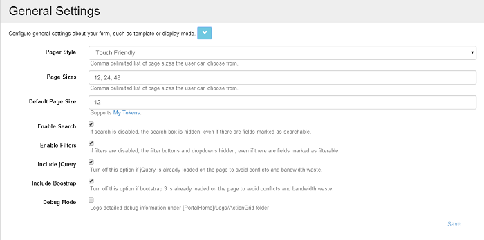

# General Settings

To sum up, the general settings allow you to configure the appearance of the grid.

These are the settings that can be modified:

* Pager Style
* Page Sizes
* Default Page Size
* Debug Mode \(when checked, it will log detailed debug information under `[PortalHome]/Logs/ActionGrid` folder\)

The **General Settings** section is displayed for admins only and here you can configure the grid's display mode. Here are various options like the **Page style** from where you can choose if the page will be Touch friendly or Classic, or the **Page sizes** option where you have the possibility to add other sizes by using the comma separator or to change the **Default Page Size** from 12 \(we've set this 12 default size because it's compatible with the 12 column grid system and we prefer to use this default size option\).

Other options are the **Enable Search** and **Enable Filters** boxes - if they are not checked, then the search box and the filters will not be displayed on the grid even though there are fields marked as filterable or searchable. The Include jQuery and the Include Bootstrap options are checked by default, their purpose is to include their own versions of jQuery and Bootstrap libraries in order to avoid conflicts.

### Grid minimum column width

If you would like to set a minimum column width in Action Grid, you can employ the following CSS:  
`css        
div.angrid .angrid-row td:nth-child(7) {min-width:350px;!important}` \(this works in Chrome and IE9 +\)

and

`css        
div.angrid .angrid-row td:first-child + td + td + td + td + td + td {min-width:350px;!important}` \(this works in IE8\)

### Create a list inside the PDF template

Right now the only way to create a list inside the PDF template is through My Tokens using a Razor token that loops over a SQL token. I believe there's an example here [my-tokens.dnnsharp.com/scripts-templates](http://my-tokens.dnnsharp.com/scripts-templates).

### Drag and Drop Actions

The Drag and Drop actions option provides the ability to perform certain actions after the position of a record from Action Grid is modified. It runs the set actions immediately after a drag and drop event.

The tokens below are generated and can be used later in actions:

* \[&lt;FieldName&gt;\] - contains all the corresponding data of the moved row; 
* \[prev:&lt;FieldName&gt;\] - contains all the corresponding data for the row situated above the moved row. 

The datasource information of the set Action Grid is not automatically updated to reflect the changes.

This option is available only in grid template. 

