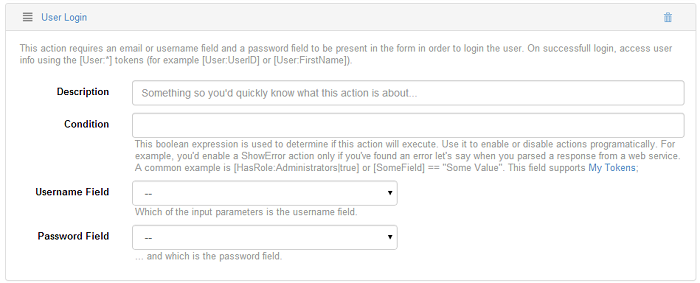
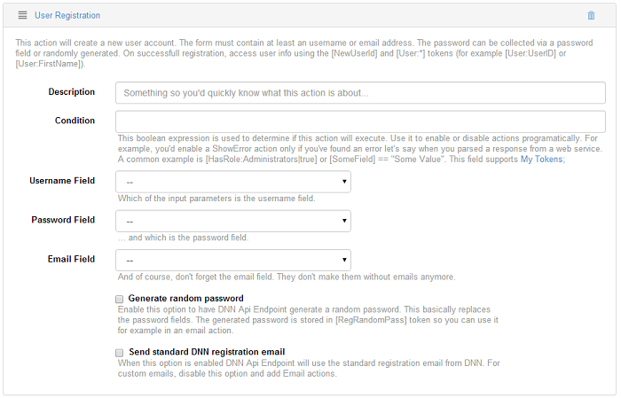
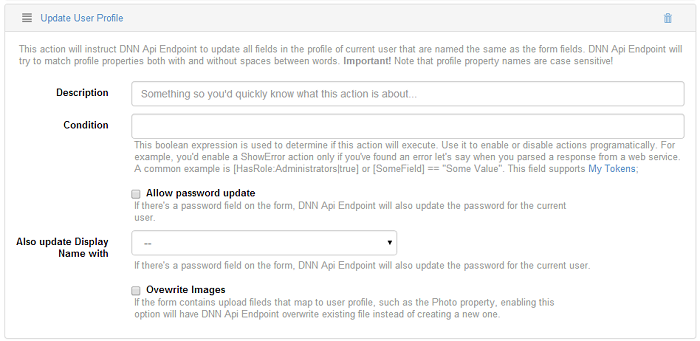
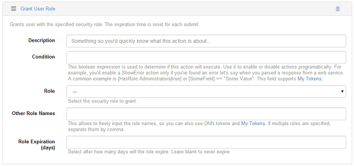

# User

## User Login

Action Grid allows you to require the user to be logged in to view and edit the grid. You also can use this action on a grid button to log in a user when clicks on the button - this is a simple form with username and password fields. Note that the form must contain the Username and Password fields so the User Login action applied to the button to work.

## User Registration

Action Grid allows you to specify an action for creating user account when the user clicks on a button which uses this action. This action sets the email address as the username. This option is only applicable for new users. User Registration Options:
* Username, Password and Email Fields

  In these drop down lists you can choose from the fields added on the grid to determine which field will be called when the action from the button is executed. 
* Generate random password

  Enable this option to have DNN Api Endpoint generate a random password. This basically replaces the password fields. The generated password is stored in [RegRandomPass] token so you can use it for example in an email action.
* Send standard DNN registration email

  When this option is enabled DNN Api Endpoint will use the standard registration email from DNN. For custom emails, disable this option and add Email actions.

## Update User Profile

Action Grid allows you to setup some actions so that the users can update their profile information. It is a very useful option when your site has an intranet section. Update User Profile options:
* Allow password update

  If there's a password field on the form, DNN Api Endpoint will also update the password for the current user.
* Also update Display Name with
  
  In this drop down list you can select a corresponding field which were previously added as data source and which will be called when the buttons action is executed. 

## Grant User Role

Action Grid allows you to assign additional roles to the user as well as to apply an expired date to each role. Grant User Role options:
* Role

  This option allows you to grant a security role. Select one from the drop down list. 
* Other Role Names

  This option gives you the possibility to input a role name and if you specify multiple role names, separate them by comma. It also accepts DNN tokens and My Tokens. 
* Role expiration

  In this field you can input after how many days the role expires. It you leave it blank, it will never expire.

## Revoke User Role

This action is used with the purpose to revoke the specified security role from the current user.

## Clear User Cache

This action requires an email or username field and a password field to be present in the fields which are linked to the action in order to login the user. On successful login, access user info using the `[User:*]` tokens (for example `[User:UserID]` or `[User:FirstName]`).

